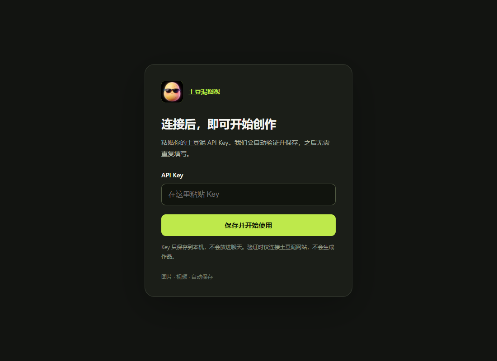

# 土豆泥图视

### 把想象，带到画面里。

在 Codex 与 Claude Code 中，用自然对话开启图片与视频创作。

[下载最新版](https://github.com/TWOV2x/tudouni-lens/releases/latest) · [土豆泥官网](https://tudouni-api.com) · [本次更新](https://github.com/TWOV2x/tudouni-lens/releases/tag/v2.5.2)

---

## 你的创作，从一句话开始

“帮我做一张电影感海报。”

“我想把这个故事，变成一段视频。”

“打开土豆泥菜单，看看今天能用哪些模型。”

把想法告诉助手。土豆泥图视带你连接、选择合适的创作方式，并把作品保存到当前项目。

## 这一次，让创作更顺手

### 一个菜单，打开更多可能

图片、视频、模型选择与作品入口，在对话里清晰展开。想看什么，直接说；随时一句“菜单”，回到创作起点。

### 连接一次，专心创作

首次使用，在连接窗口填写你的土豆泥 API Key。当前项目后续创作沿用已有连接，不必反复填写。

### 模型上新，菜单随行

每次打开菜单，都会重新读取当前账号可用的图片与视频模型。选择跟着网站更新，灵感不被固定清单限制。

### 接着上次的灵感，继续往前

查看已有作品，接续正在进行的任务；成品下载遇到中断，也可以让助手继续保存。

### 熟悉的对话，统一的图视体验

面向 Codex 与 Claude Code，提供插件版与独立 skill 版。使用自己的土豆泥 API Key，按你的创作节奏开始。

## 第一次见面，只需这样开始

1. 从 [最新发布页](https://github.com/TWOV2x/tudouni-lens/releases/latest) 下载适合客户端的版本。
2. 把安装包交给助手，说：**“安装土豆泥图视，并打开菜单。”**
3. 按提示完成一次连接，然后说出你想创作的画面。

  

Key 在连接窗口填写，不需要发到聊天里。安装、连接和作品整理，让助手带你完成。

## 你可以这样说

- **“打开土豆泥菜单。”** — 回到创作入口。
- **“看看视频菜单。”** — 浏览当前可用的视频模型。
- **“生成一张暖色调的咖啡品牌海报。”** — 开始图片创作。
- **“做一段清晨山间云海的视频。”** — 开始视频创作。
- **“我的作品在哪？”** — 找到已有作品。
- **“继续刚才的任务。”** — 接着完成未结束的创作。

## 看看灵感的另一种样子

### 一张画面，留下故事的温度

已有创作示例：月下的灯火、临行前的针线，把一句想法变成有情绪的画面。

  

### 一段动态，让想象开始奔跑

已有视频作品画面：卡丁车、弯道与追逐，把轻松的创意带进动态世界。

  

## 选择适合你的版本

- **[插件版](https://github.com/TWOV2x/tudouni-lens/releases/download/v2.5.2/tudouni-lens-plugin-v2.5.2.zip)**：适合支持插件安装的客户端，统一品牌图标与创作入口。
- **[独立 skill 版](https://github.com/TWOV2x/tudouni-lens/releases/download/v2.5.2/tudouni-lens-skill-v2.5.2.zip)**：适合通过 skill 使用的环境，保留同样的对话创作方式。

两种版本选择一种即可。[简明安装指引](INSTALL.md)

可用模型、规格与价格以当前账号页面为准；新模型的创作支持以菜单提示为准。客户端需具备正常的工具运行能力。模型菜单更新与插件版本升级分别进行。

---

**土豆泥图视 · 让灵感，有处落笔。**

[访问土豆泥](https://tudouni-api.com) · [下载最新版](https://github.com/TWOV2x/tudouni-lens/releases/latest)

